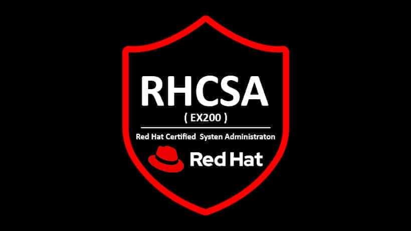

# RHCSA-EX200

RHCSA EX200 Study Notes  and Lab Environment.

<h1>RHCSA EX200 EXAM</h1>

Compulation of notes, lab setup & suggestions, questions, and exercises to prepare for the EX200 certification exam

## [**Red Hat Certified System Administrator (RHCSA)**](https://www.redhat.com/en/services/training/ex200-red-hat-certified-system-administrator-rhcsa-exam?section=objectives)

    <h2>Exam Objectives <a href="https://www.redhat.com/en/services/training/ex200-red-hat-certified-system-administrator-rhcsa-exam?section=objectives">ref.<a></h2>
    <ul>
        <li>Understand and use essential tools</li>
        <li>Create simple shell scripts</li>
        <li>Operate running systems</li>
        <li>Configure local storage</li>
        <li>Create and configure file systems</li>
        <li>Deploy, configure, and maintain systems</li>
        <li>Manage basic networking</li>
        <li>Manage users and groups</li>
        <li>Manage security</li>
        <li>Manage containers</li>
    </ul>

    

